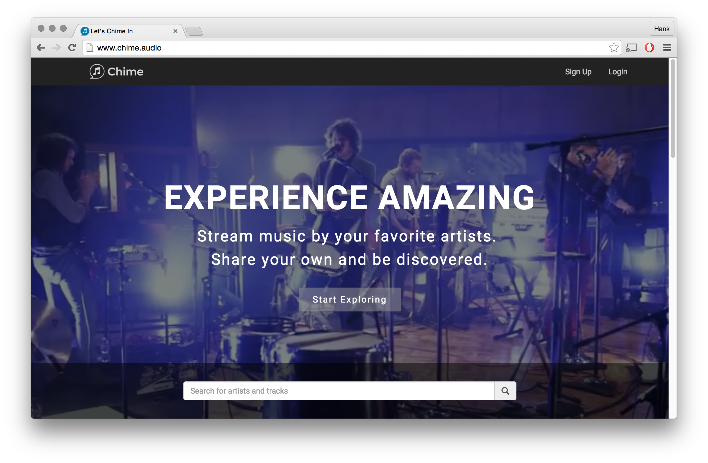
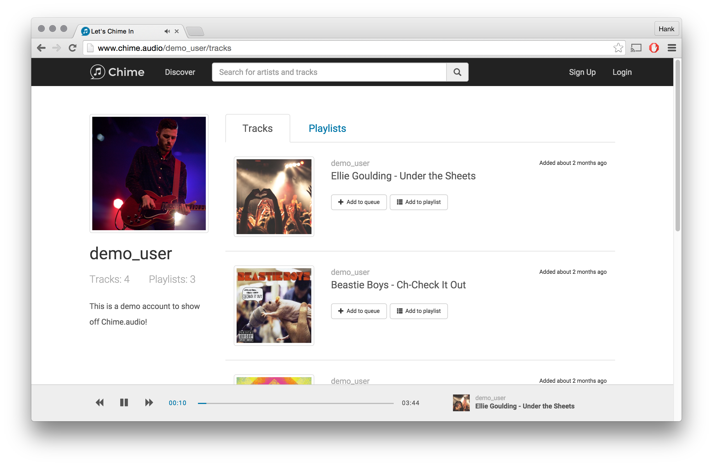

<div align="center">



# 🎵 Chime

### Plataforma web de streaming y compartición musical inspirada en SoundCloud 🚀

<p align="center">
  <b>Chime</b> es una aplicación web moderna enfocada en streaming musical, subida de canciones y descubrimiento de artistas, permitiendo a los usuarios compartir audio, crear playlists y explorar música de otros creadores.
</p>

<p align="center">
  
  
  
  
</p>

<p align="center">
  <a href="#-preview">Preview</a> •
  <a href="#-características">Características</a> •
  <a href="#-arquitectura">Arquitectura</a> •
  <a href="#-tecnologías-utilizadas">Tecnologías</a> •
  <a href="#-instalación">Instalación</a>
</p>

</div>

---

# ⚠️ Estado del Proyecto

## 🚧 Proyecto Descontinuado

Este proyecto ya no recibe mantenimiento activo.

Aun así, sigue siendo un excelente proyecto de referencia para aprender:

- 🎵 Streaming musical web
- ⚡ Arquitectura Full Stack
- 🌐 Aplicaciones SPA
- ☁️ Integración con almacenamiento cloud
- 🎧 Reproductores multimedia web
- 🔐 Autenticación de usuarios

---

# 🌌 Acerca de Chime

**Chime** es una plataforma de streaming musical inspirada en SoundCloud, diseñada para que artistas y usuarios puedan subir, compartir y descubrir música online.

La aplicación permite:

- 🎵 Reproducir música online
- 📤 Subir canciones propias
- 🎧 Crear playlists
- 🔎 Buscar artistas y tracks
- 🖼️ Gestionar imágenes de perfil y portadas
- ☁️ Compartir contenido musical

El proyecto fue desarrollado como una experiencia práctica Full Stack utilizando Ruby on Rails y React.js.

---

# 📸 Preview

<div align="center">


<br><br>



</div>

---

# ✨ Características

# 🎵 Plataforma de Streaming

- ▶️ Reproducción musical online
- 🎧 Controles multimedia avanzados
- 🔄 Playback continuo sin interrupciones
- ⚡ Cola temporal de reproducción
- 🎶 Experiencia similar a SoundCloud

---

## 📤 Gestión de Audio

- ☁️ Subida de canciones
- 🎵 Administración de tracks
- 📂 Organización multimedia
- ⚡ Streaming dinámico
- 🎧 Biblioteca personal

---

## ❤️ Playlists Inteligentes

- 🎶 Crear playlists personalizadas
- ▶️ Reproducción secuencial
- 📚 Gestión de colecciones musicales
- 🔥 Experiencia social musical

---

## 🔎 Sistema de Búsqueda

- 👤 Buscar usuarios
- 🎵 Buscar canciones
- ⚡ Navegación rápida
- 🌐 Descubrimiento de artistas

---

## 🖼️ Gestión Multimedia

- 📷 Imagen de perfil
- 🎨 Portadas de canciones
- ☁️ Almacenamiento multimedia
- 🔥 Integración visual moderna

---

# 🏗️ Arquitectura

## ⚡ Aplicación Single Page Application

Chime fue construido como una SPA moderna utilizando:

- Ruby on Rails Backend
- React.js Frontend
- RESTful APIs
- Gestión de estado frontend
- Streaming multimedia web

---

## ☁️ Almacenamiento Cloud

- Amazon S3
- Upload de archivos
- Hosting multimedia
- Gestión de imágenes y audio

---

# 🛠️ Tecnologías Utilizadas

## 🌐 Full Stack Development

<p>
  
</p>

- Ruby on Rails
- React.js
- Redux
- JavaScript
- PostgreSQL
- HTML5
- CSS3

---

## ☁️ Herramientas y Servicios

<p>
  
</p>

### Tecnologías principales

- Amazon S3
- REST APIs
- Authentication System
- Audio Streaming
- Media Upload System

---

# 📂 Estructura del Proyecto

```bash
chime/
│
├── app/                     # Backend Rails
├── frontend/                # Aplicación React
├── docs/                    # Documentación e imágenes
├── db/                      # Base de datos y migraciones
├── config/                  # Configuración Rails
├── public/                  # Recursos públicos
├── package.json
├── Gemfile
└── README.md
```

---

# ⚡ Instalación

## 1️⃣ Clonar repositorio

```bash
git clone https://github.com/isairey/Chime
```

---

## 2️⃣ Entrar al proyecto

```bash
cd Chime
```

---

## 3️⃣ Instalar dependencias Backend

```bash
bundle install
```

---

## 4️⃣ Instalar dependencias Frontend

```bash
npm install
```

---

## 5️⃣ Configurar base de datos

```bash
rails db:create
rails db:migrate
```

---

## 6️⃣ Ejecutar servidor

```bash
rails server
```

---

# 📦 Funcionalidades Técnicas

## 🎧 Audio Streaming Engine

- Streaming online
- Cola de reproducción
- Playback persistente
- Gestión multimedia web

---

## 🔐 Sistema de Usuarios

- Registro y login
- Autenticación segura
- Gestión de perfiles
- Contenido personalizado

---

## ☁️ Cloud Media Storage

- Upload de audio
- Upload de imágenes
- Amazon S3 Integration
- Gestión multimedia remota

---

# 🧠 Objetivos del Proyecto

## 🎯 Aprender y practicar

- Ruby on Rails
- React.js
- Streaming multimedia
- Aplicaciones SPA
- Arquitectura Full Stack
- APIs REST
- Cloud Storage
- Desarrollo web moderno

---

# 📑 Documentación Técnica

## 📚 Recursos incluidos

- 📄 Proposal
- 🗄️ Database Schema
- ⚙️ Backend Architecture
- 🎨 Frontend Structure
- ☁️ File Storage System
- 🚀 Future Implementations

---

# 📊 Roadmap

## 🚧 Futuras mejoras planeadas

- 💬 Comentarios en canciones
- ❤️ Likes y favoritos
- 📱 Responsive Mobile UI
- 🔥 Recomendaciones inteligentes
- 🎶 Sistema de seguidores
- 📊 Estadísticas de reproducción
- 🎧 Equalizer web
- 🌙 Dark Mode

---

# 🤝 Contribuciones

Las contribuciones son bienvenidas ❤️

## Pasos para contribuir

1. Haz Fork del proyecto
2. Crea una rama

```bash
git checkout -b feature/nueva-funcion
```

3. Realiza tus cambios
4. Haz commit

```bash
git commit -m "✨ Nueva funcionalidad"
```

5. Haz push

```bash
git push origin feature/nueva-funcion
```

6. Abre un Pull Request 🚀

---

# 👨‍💻 Autor

<div align="center">

## Hank Fanchiu

Full Stack Developer apasionado por plataformas multimedia, streaming musical y aplicaciones web modernas.

</div>

---

# 🌟 Apoya el Proyecto

Si te gusta Chime:

⭐ Dale una estrella al repositorio  
🍴 Haz Fork del proyecto  
📢 Compártelo con otros desarrolladores

---

# 📜 Licencia

Proyecto Open Source utilizado con fines educativos y de aprendizaje.

---

<div align="center">

### 🎵 Chime — Streaming musical moderno inspirado en SoundCloud.

</div>
